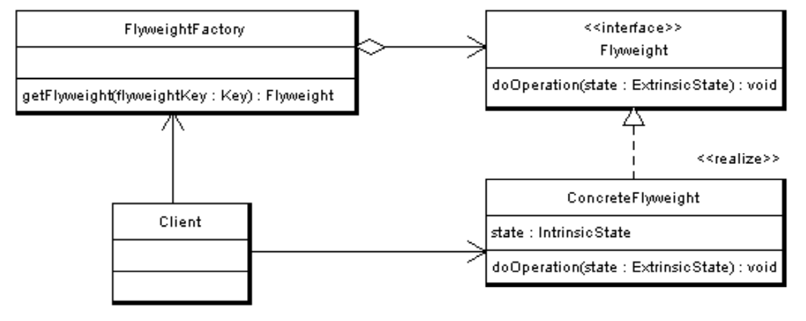

# Flyweight

## Motto
Efektywne zarządzanie wieloma drobnymi obiektami.

## Zastosowanie

Wzorzec możemy zastować gdy:
* aplikacja musi tworzyć ogromną liczbę podobnych obiektów, co powoduje wyczerpanie całej dostępnej pamięci RAM na urządzeniu docelowym
* obiekty zawierają zduplikowane stany, które można wyodrębnić i udostępnić między wieloma obiektami

## Struktura wzroca [(source)](https://pl.wikipedia.org/wiki/Pyłek_(wzorzec_projektowy)#Struktura_wzorca)



> Istotą wzorca jest podział danych przechowywanych w ciężkim obiekcie na wewnętrzne (intrinsic) i zewnętrzne (extrinsic). Do klasy danych wewnętrznych wybierane są te składowe ciężkiej klasy pierwotnej, których wartości często się powtarzają. Pozostałe składowe stanowią dane zewnętrzne. Po ustaleniu podziału zamiast ciężkich obiektów wzorzec wprowadza odpowiadające im obiekty klientów oraz tzw. obiekty pyłków. Obiekty pyłków są tworzone z wybranych wcześniej danych wewnętrznych. Każdy z nich jest współdzielony przez wielu klientów i nie można go modyfikować. Dane zewnętrzne, unikatowe dla każdego obiektu klienta, są dostarczane obiektowi pyłku poprzez określone metody. Wzorzec zawiera dwóch uczestników - Fabrykę Pyłków i Pyłek. Klient nie tworzy egzemplarzy typu Pyłek samodzielnie, a jedynie wysyła do Fabryki żądanie ich udostępnienia. Fabryka zwraca Klientowi istniejący Pyłek lub tworzy nowy, jeśli żaden egzemplarz tej klasy jeszcze nie istnieje.


## Flewight, a Object Pool

Flyweight w implementacji przypomina Object Pool. Różnica jest taka, że Pool utrzymuje pulę
rozłącznych obiektów, zwraca za każdym razem inną instancję, a po użyciu instancja ta wraca do
puli. Motywacją dla Object Pool jest bardzo kosztowne tworzenie instancji.


## Przykład z wiki

```ruby
# Flyweight Object
class Lamp
  attr_reader :color

  def initialize(color)
    @color = color
  end
end

class TreeBranch
  def initialize(branch_number)
    @branch_number = branch_number
  end

  def hang(lamp)
    puts "Hang #{lamp.color} lamp on branch #{@branch_number}"
  end
end

# Flyweight Factory
class LampFactory
  def initialize
    @lamps = {}
  end

  def find_lamp(color)
    @lamps[color] ||= Lamp.new(color)
  end

  def size
    @lamps.size
  end
end

class ChristmasTree
  def initialize
    @lamp_factory = LampFactory.new
    @lamps_hung = 0

    dress_up_the_tree
  end

  def hang_lamp(color, branch_number)
    TreeBranch.new(branch_number).hang(@lamp_factory.find_lamp(color))
    @lamps_hung += 1
  end

  def dress_up_the_tree
    hang_lamp('red', 1)
    hang_lamp('blue', 1)
    hang_lamp('yellow', 1)
    hang_lamp('red', 2)
    hang_lamp('blue', 2)
    hang_lamp('yellow', 2)
    hang_lamp('red', 3)
    hang_lamp('blue', 3)
    hang_lamp('yellow', 3)
    hang_lamp('red', 4)
    hang_lamp('blue', 4)
    hang_lamp('yellow', 4)
    hang_lamp('red', 5)
    hang_lamp('blue', 5)
    hang_lamp('yellow', 5)
    hang_lamp('red', 6)
    hang_lamp('blue', 6)
    hang_lamp('yellow', 6)
    hang_lamp('red', 7)
    hang_lamp('blue', 7)
    hang_lamp('yellow', 7)
    puts "Made #{@lamp_factory.total_number_of_lamps_made} total lamps"
    puts "Hung #{@lamps_hung} total lamps"
  end
end
```

## Mój przykład

Problem:
```ruby
class Lamp
  attr_reader :color, :type, :x, :y

  TYPES = [:mini, :c6, :g12]

  def initialize(x, y, color, type)
    raise ArgumentError "Unknown lamp type" unless TYPES.include? type

    @color, @type, @x, @y = color, type, x, y
  end

  def render
    puts "Rendering #{color} #{type} lamp at (#{x}, #{y})"
  end
end

class ChristmasTree
  
  def initialize
    @lamps = []
  end

  def hang_lamp(lamp)
    @lamps << lamp
  end

  def render
    @lamps.each(&:render)
  end
end
```
Mamy miliony instancji klasy `Lamp`.
Chcemy zoszczędzić pamięć.
Możemy zauważyć, że argumenty `@color` i `@type` będą się często powtarzać.
Zatem te argumenty są intrinsic i możemy je wydzielić do obiektu pyłku.  

```ruby
class LampType
  attr_reader :color, :type
end

class Lamp
  attr_reader :x, :y
  delegate :color, :type, to: :@lamp_type

  TYPES = [:mini, :c6, :g12]


  def initialize(x, y, color, type)
    raise ArgumentError "Unknown lamp type" unless TYPES.include? type

    @x, @y =  x, y
    @lamp_type = LampTypeFactory.instance.get(color, type)
  end

  def render
    puts "Rendering #{color} #{type} lamp at (#{x}, #{y})"
  end
end
```

## Źródła:

* https://pl.wikipedia.org/wiki/Pyłek_(wzorzec_projektowy)
* https://refactoring.guru/design-patterns/flyweight
