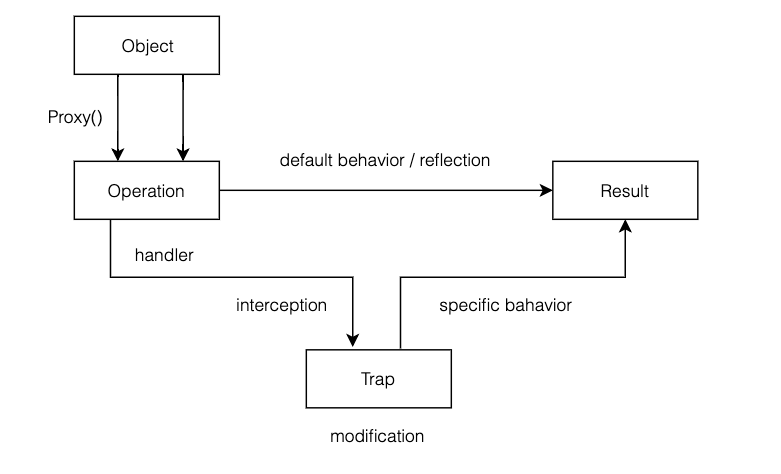

### Proxy, reflection and metaprogramming in js
  
Since I started using javascript in my everyday work and migrated from backend world I’ve experienced some strange aspects 
of that language. One of them annoys me - `undefined` instead of code execution error (among others when accessing property that doesn't 
exist). Javascript behavior in this aspect is slightly different from Ruby, Python and from the most programming languages:

``` javascript
// javascript
const obj = { name: 'Max' };

obj.name //=> 'Max'
obj.surname //=> undefined
 ``` 

and Ruby equivalent:

``` ruby
# ruby
obj = { name: 'Max' }

obj.fetch(:name) #=> 'Max'
obj.fetch(:surname) #=> Error! Key not found: :surname
obj[:surname] #=> nil

# tl;tr obj[:surname] is not the case here
obj.fetch(:surname) #=> Error! Key not found: :surname // not specified default value
obj.fetch(:surname, nil) #=> nil // if key does not exist it returns (default value = nil)
obj[:surname] #=> nil // as above (default value = nil by default. No need to specify)
obj[:surname] == obj.fetch(:surname, nil) #=> true // the same behaviour
```
Ruby execution is a little bit confusing since programmers are familiar with `obj[:key]` notation which doesn't produce 
an error. Let's take a look at Python example:

``` python
# python
obj = { name: 'Max' }

obj['name'] #=> 'Max'
obj['surname'] #=> Error! KeyError: 'surname'
```
As you can see in the examples above, Python and Ruby (with non-specified `default_value`) produce the errors. If a property does not exist the code execution 
ends with error! Excellent! It appeals to me! Imagine the situation you are working on a big js project and small property 
typo breaks all results of a computation - because you got undefined instead of the key not found error - you don’t know why 
and where it occurred since it’s plenty of possibly places for undefined (debugging undefined takes a long time). Don’t worry - es6 standard gives 
us solutions for circumventing unexpected and default javascript behavior via Proxy object.

### `Proxy` object as the way of metaprogramming

Before all, the important part is an understanding reflection and reflective programming/metaprogramming in computer science.
The definition of reflection sounds:

>Reflection is the ability of a computer program to examine, introspect, and modify its own structure and behavior at runtime.

In other words, reflection means that a program can process itself on three levels (_introspection_, _self-modification_, _intercession_). 
ECMAScript 5 has provided the ability to reflective introspection and self-modification. You can use `Object.keys()` for introspection 
and you can simply self-modify an object using i.e. `delete`.  All `Object.*` methods can be considered as reflective methods of metaprogramming, but
neither them nor another ES5 features support the third level of reflection - behavioral level, and  that's the reason for introducing proxies in ES6. `Proxy` is the way for changing built-in language operations. 

> The Proxy object is used to define custom behavior for fundamental operations (e.g. property lookup, assignment, enumeration, function invocation, etc). (official docs)

Proxy is the way for virtualizing given object - a proxy object looks the same as a given object and all operations on an object 
refer to the already created proxy object. In general, the object has a custom set of methods (which produce specific behavior) and 
a proxy is a way to take control of them (define custom behavior).

``` javascript
// javascript
const object = { name: 'Max' };
const proxy = new Proxy(object, {});

object.name //=> Max
proxy.name //=> Max

object.name = 'Claire'

proxy.name //=> Claire
object.name //=> Claire
```

Nothing special above, virtualization of the object and the property lookup without invoking any operations
(see: [no-op forwarding](https://developer.mozilla.org/en-US/docs/Web/JavaScript/Reference/Global_Objects/Proxy#No-op_forwarding_proxy)). 
If you add a property for an object, the same property for a proxy object will be added. Some kind of a symlink, but proxies are built 
for intercepting the low-level operations on the target object indeed. The first argument for the Proxy is a target, the second is a 
handler. Let's find a solution for the problem displayed at the beginning.

### Error instead of `undefined` 
#### when accessing non-existent property with get trap

At the beginning let's see how proxy can express default js engine behavior:

``` javascript
// javascript
const object = { name: 'Max' };

object.name //=> Max
object.surname //=> undefined

// default js behaviour with proxy
const proxy = new Proxy(object, { // init the proxy with the target
  get(trapTarget, key, receiver) { // added the get trap
      return Reflect.get(trapTarget, key, receiver) // run default behaviour
    }
});

object.name //=> Max
proxy.surname //=> undefined
```
Let's change default behaviour:

``` javascript
// javascript
const object = { name: 'Max' };

object.name //=> Max
object.surname //=> undefined

// changing default js behaviour with proxy
const proxy = new Proxy(object, {
  get(trapTarget, key, receiver) {
    if (!(key in receiver)) {
      throw new TypeError(`undefined key ${key}`) // error if key does not exist
    }
    return Reflect.get(trapTarget, key, receiver)  // run default behaviour
  }
});

object.name //=> Max
object.surname //=> TypeError: undefined key surname
```
As you see above, I use get trap to intercept default behavior when accessing the property. I passed three arguments to the trap
first: `trapTarget` - target object for the proxy, second: `key` - property  and third: `receiver` - it's the proxy reference.
Logic ends with returning `Reflect` - it is the js object without constructor (has only static methods) 
which expresses default js behavior. Every proxy trap has an equivalent in `Reflect` method. 



Intercepting operations are possible by handler with a proxy's trap - the function that is responsible for proper operation and it's passed always as the second proxy argument.
On the diagram I've displayed two branches - default behavior, and interception of default behavior by Proxy. 
Default reflection on the basic level returns `undefined`. We can achieve the same result with proxy too. 

``` javascript
// javascript
new Proxy(targetObject, {
  get(target, key, receiver) { 
    return Reflect.get(target, key, receiver)
  }; 
});
```

The second branch - `Proxy` intercepts default behaviour by get trap in the handler and raises an error in the code example if property does not exist.
Note: `get` trap is one of many others traps - 
[see all available traps for the `Proxy`](https://developer.mozilla.org/en-US/docs/Web/JavaScript/Reference/Global_Objects/Proxy#Methods_of_the_handler_object). 

### Building two-way data binding using `Proxy`

Moving on let’s dive into a more complex thing. If you’re AngularJS or Vue dev you’re probably familiar with two-way 
data binding concept as it is the main part of these frameworks.

> Two-way-data binding links the state with the view. If the state changes the view is updated and if the view changes 
the state will be updated.

If you want to write your own js framework based on two-way data binding then Proxy is the way to go. A proxy can link our 
view with application state. Look at the following example:

``` html
<!-- html -->
<div class="app">
  <div class="field">
    <label for="name">My name is:</label>
    <input id="name" type="text" name="name" data-model="name" />
  </div>
  <div class="field">
    <label for="hobby">My hobby is:</label>
    <input id="hobby" type="text" name="hobby" data-model="hobby" />
  </div>
  <div class="app-state">
    <h4 data-model="app-state" />
  </div>
</div>
```
``` javascript
// javascript
// set state interface (models)
let stateInterface = {
  name: '',
  hobby: ''
};

// set a trap!
const state = new Proxy(stateInterface, {
  set(trapTarget, key, value, receiver) {
    setInputValue(key, value) // update input values in the view before setting property
    return Reflect.set(trapTarget, key, value, receiver); // call default set behaviour
  },
});

// set default values
state.name = 'John'
state.hobby = 'Football'

// find input DOM element and update its value with state value
// linking state with the view
function setInputValue(id, value) {
  document.querySelector(`[data-model="${id}"]`).value = value;
}


// change app state when input value changes in the DOM
// linking view with the state
function onInputChange(event) {
  state[event.target.dataset.model] = event.target.value;
};

// add listeners to inputs
Object.keys(stateInterface).map(id => {
  const element = document.querySelector(`[data-model="${id}"]`)
  element.addEventListener('keyup', onInputChange)
})
```
[see live example](https://jsfiddle.net/edzv5L0q/)<br>

Views and state - two things have been linked. Changing state changes the view. At first, I added the new attribute
`data-model` to the DOM inputs elements. The model links input value with the app state, so that's the main part of 
two-way data bindings. I designed a simple state interface afterwards that contains two keys (name and hobby). 
The important thing - only set keys in the interface can be updated in the proxy - i.e. `state.strangerKey = 'Hello'` will raise an error.
Next thing is creating a proxy with `set` trap in the handler. Between calling default engine set behaviour we added `updateView` - 
it means that every attempt of setting state will update the input values in the view. For view to state direction 
I implemented listeners that listen on input value changes in the view and trigger state change. So the important thing is 
registering listeners on DOM elements as only registered listeners can change the state via `onInputChange` event handler.  

The journey with Proxy wound up, I presented the most common proxy traps - get and set trap, but keep in mind 
that Proxy supports twelve more handlers which can be used in different ways, especially in metaprogramming.

PS. Metaprogramming rocks :).
